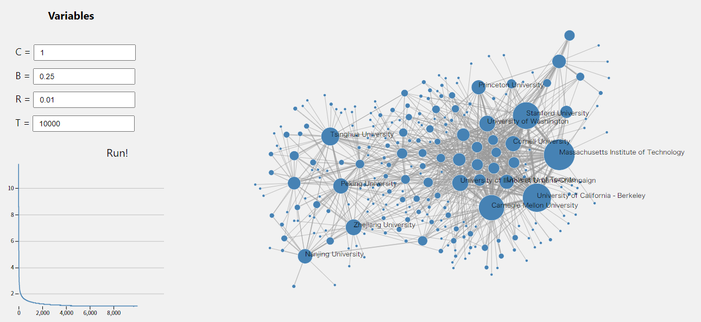
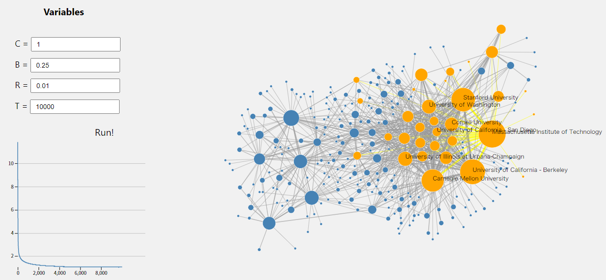
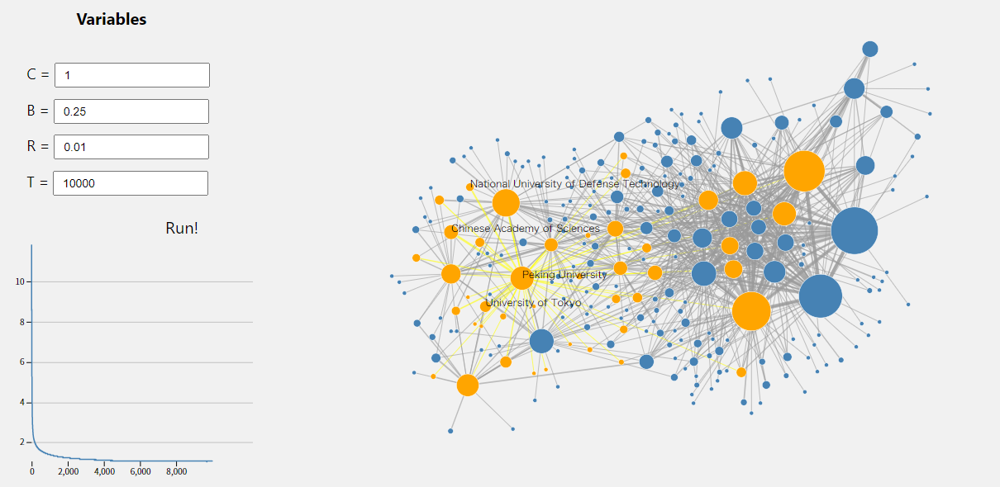

# 可视化与可视计算 第二次作业

1800011307 李星桥

## 数据描述与分析

数据描述的是国内外知名高校的一所高校博士生到另一所高校任职的情况，表现为图的形式，图的边权值指示博士生流动的人数。

数据的规模为256点加上846边，其中有一些点出度和入度较高，出入度的差异较大。

对这个数据的分析，首先需要一个足够清晰的图可视化，而这需要一个良好的力导向图设计。在力导向图的基础上，可以分析其中主要（入度和出度较高）的几个高校相互流动情况，高校人员流动的聚类分析。如果在给定数据之外再加上一些额外数据，则可以分析中外高校博士生流动比较，高校人员流动与地理位置关系等等。

## 算法的设计与分析

### 原始算法介绍

首先是力导向图的算法。

使用论文[1]中的算法，也就是力导向算法的改进版本：`Δx/Δt=F`，其中`F`由两部分构成：一部分是排斥力，这部分存在于每两个节点之间，使得节点分散；另一部分是吸引力，仅存在于被一条边连起来的两个节点之间，使得一条边连着的两节点有接近趋势。两力结合，使得节点之间的距离比较均匀。斥力和引力的比值用一个参数`C`来控制。

进行若干次迭代，记为`T`次。每一次迭代过程中，计算引力和斥力的和。引入一个参数温度，限制力的大小不能超过此温度。每次迭代，将各点沿着力的方向进行移动。其实，力导向布局中的力和物理中的力没有什么关系，而更像是梯度下降算法（Gradient Descent）的迭代步长，因此并不需要引入速度和加速度的概念。引入速度之后，将引起振荡，但这不是我们想要的优化目标。迭代的过程中，缓慢减小温度，直到最后收敛。

当点运动中碰到边界时，假设点与边界发生非弹性碰撞，以此避免点跃出边界之外。

每一步迭代过程需要计算力，时间复杂度为`O(V^2+E)`，算法总的时间复杂度为`O(T(V^2+E))`。利用空间数据结构可以进一步优化。

### 修改后的算法

直接使用论文中的原始算法容易出现点与点之间相互遮挡的情况；尤其是此处几个较大的点之间几乎是全连接的，因此无法分开，聚作一团。因此，可以引入一个额外的“遮挡力”：当两个点之间部分重合，则在它们之间增加一个额外的斥力，大小正比于重合的幅度。另外，为了使算法不至于错过一些更小的值，为算法加入了随机性，如果随机移动可以使能量更小则进行随机移动。这两项参数用`B`和`R`表示。

本问题的情况与原论文并非完全一致，各条边具有不同的权值。在问题中设置引力与权值成正比，使得联系更密切的点之间能有更近的距离。

### 参考文献

1. Fruchterman, T. M. J. & Reingold, E. M. Graph drawing by force-directed placement. Software: Practice and Experience 21, 1129–1164 (1991).

## 可视化结果描述

如图所示

左上为参数控制板，左下为收敛图，右侧为力导向图。从图中可以看出，较大的学术机构分成了右侧以美国高校（尤其是MIT、Stanford、UCB、CMU）主导的区域和左侧以中国高校主导的区域。由此可见，博士生找教职的路径与地理环境高度相关。

还可以进一步选择具体的高校；图中与该高校有人员往来的高校会被高亮，人员往来较多的高校会被标出名字。

从图中可见，与MIT之间人员往来较多的高校包括Stanford，CMU，UCB，UCSD等。

与北京大学之间人员往来较多的高校包括中国科学院，国防科技大学，东京大学等。
