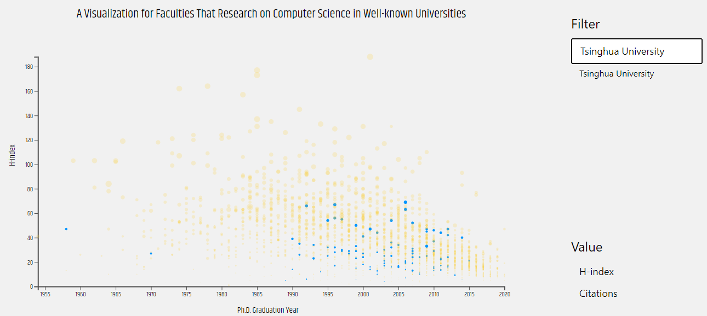
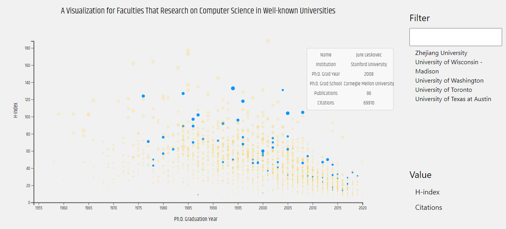
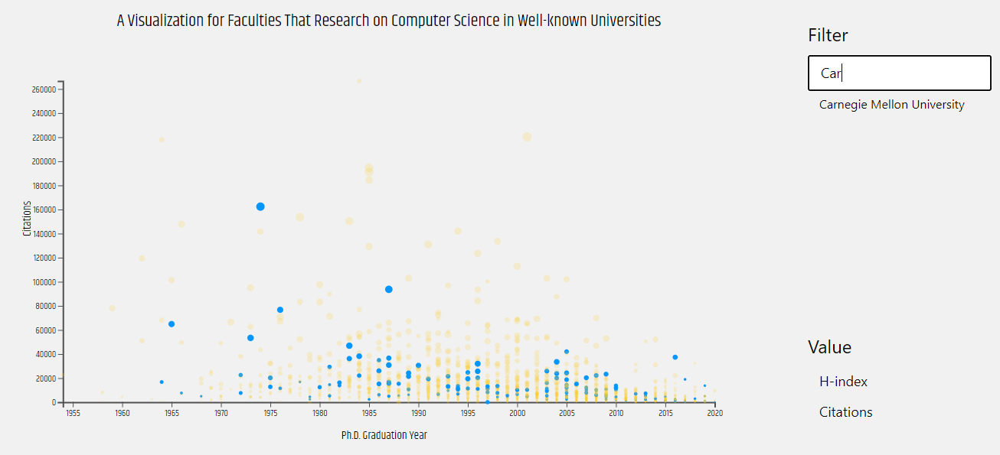

# 作业报告

1800011307 李星桥

## 数据描述与分析

数据集`data.csv`为来自27所世界知名大学的教职人员的相关数据，表现为表格形式，维度为14，主要包括Institution、Name、PhD Graduate Year/School、Research Interest、H-index、Publications等数据信息。

数据集各维度不是独立的。例如，Institution和Institution Index为一一对应关系。除此以外，注意到数据维度PhD Graduate Year和H-index、Publications、Citations、Publication Divided by Co-authors等数据为连续数值型数据，考虑利用这些数据进行可视化展现。

另外，数据集中有一些隐含的关联，通过可视化，我们可以找出这些关联。例如，毕业年份与科研水平的关联；毕业学院与就职机构的关联；某机构的整体科研水平评估；某机构研究人员的毕业年份分布；等等。在本次可视化项目中，我们集中于毕业年份与科研水平的关联，以及机构整体科研水平的可视化。

## 设计宗旨和设计过程

针对上述分析，我们选择毕业年份与科研水平关联进行集中可视化。

采用散点图的基本设计，选取横轴为毕业年份，纵轴为科研水平。然而，科研水平并非只有单一评价指标，因此在本设计中选用了Citations和H-index作为两种不同的评价指标，并使用两个按钮进行切换。由于横轴与纵轴作为区分度较高的位置信息，这样设计的优点在于清晰地显示出了毕业年份与科研水平之间的关联。同时，在使用一种评价指标时，另一种评价指标可以通过视觉表现力较弱的大小通道进行编码，这样就在一幅图中展现了两种不同的评价指标。

在可视化项目中，为了突出不同学校之间的联系，项目采用了一个交互式的设计：当鼠标移动到某个点上时，展示该点的详细信息并且突出显示与该点处在同一研究机构的所有点。这样一来，根据点的分布，我们可以大致估计该点所在研究机构的整体科研情况。作为补充，项目中增加了一个Filter，在Filter中输入研究机构的名称并按回车，也可以突出显示出研究机构的所有点。

这一设计难点在于选择合适的视觉通道突出处于同一研究机构的点。为此，项目设计了基于颜色通道和透明度的双重突出：颜色上使用对比色，突出这些点的不同；并且在选中这些点时降低这些点的透明度，增加其他点的透明度。这样一来，项目取得了良好的突出对比效果。

## 可视化结果描述

整体结果如图所示：

选中其中某个点时，结果为：

更改纵轴为Citations，并选取CMU，结果为：

从整个可视化项目中，我的发现如下：

1. 国内高校相比于世界一流名校，在总体科研水平上仍有相当差距。
2. 国内高校在计算机学科上总体起步较晚，教师团队更年轻。
3. 在整个计算机科研领域，研究人员的个体差距巨大，具体研究人员的成果并不受限于所在的研究机构。

整个项目过程中，我重新思考和认识了课堂上提到的数据编码、视觉通道等概念，并在实际操作中更深地认识了各视觉通道的差异，学会了编码视觉通道的基本方法，尤其是通过对比强调来加深视觉通道表现力的方法。除了理论的设计，整体的排版以及对不同数据规模的适应性处理也是一门学问。因此，想要真正掌握可视化技术，还需要更多实际场景的联练习，而不能拘泥于理论。